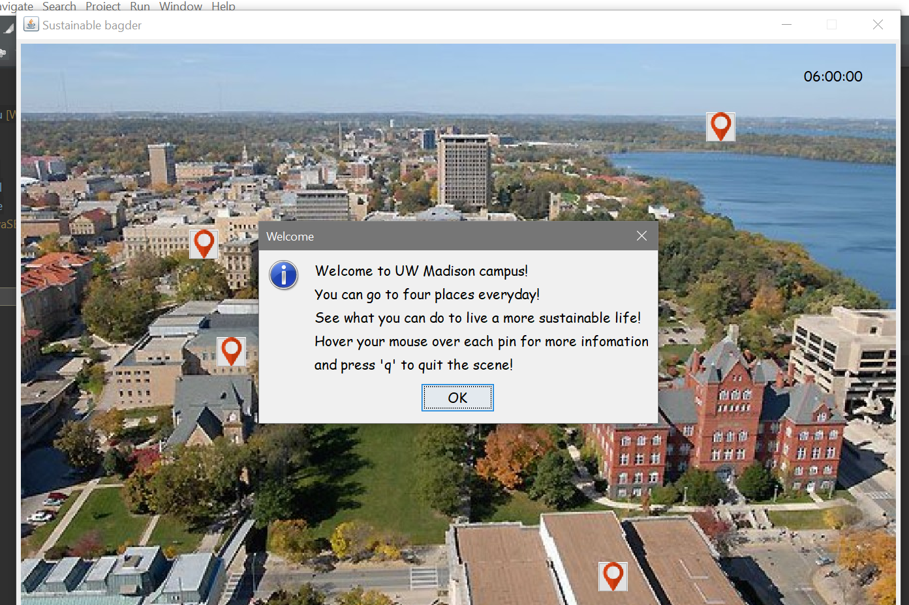
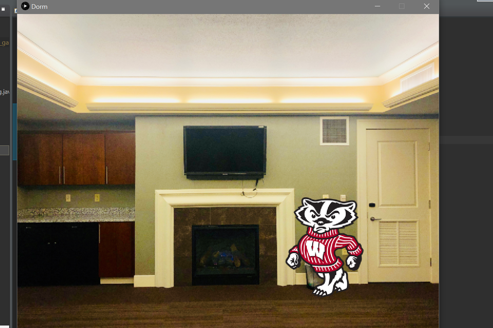
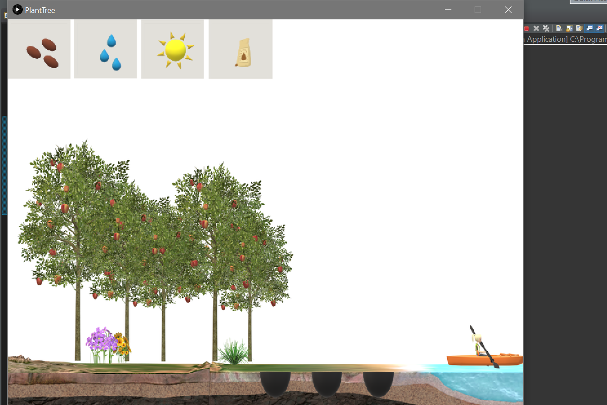
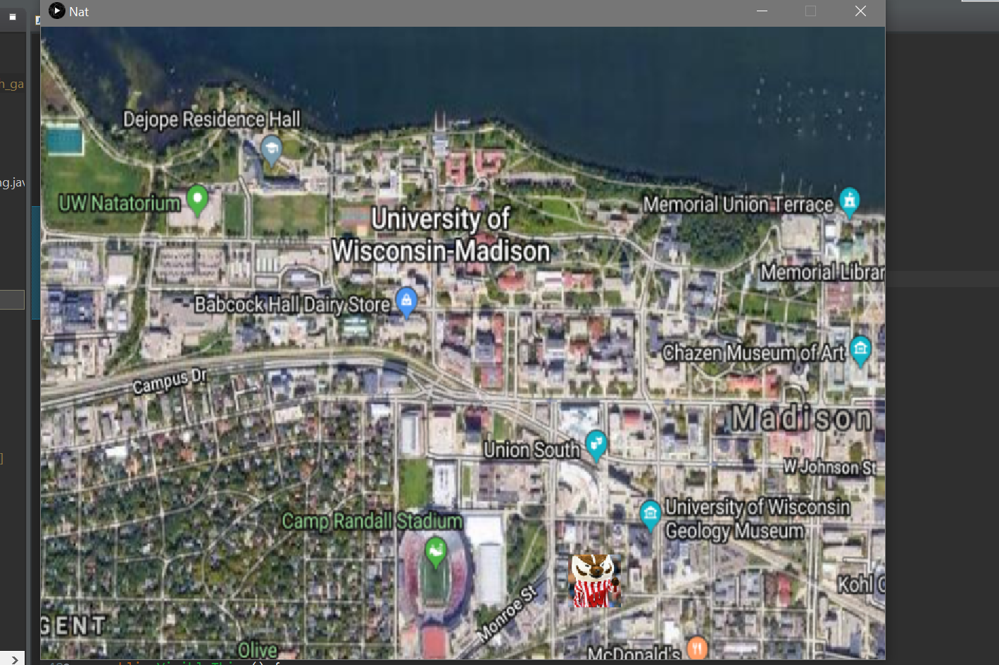

# Sustainable Badger

Play an interactive game and choose between sustainable and less sustainable options. [Learn more.](https://devpost.com/software/sustainble-badger)

## Instruction: Run MainFrame to run the program

### Map

- Explore different places on the UW campus and learn how to live a more sustainbale life

### Dorm

- Find and turn off the electrical appliances that waste energy in the dorm

### Picnic Point

- Please plant more trees to protect the lake nature preserve

### Rheta's Market

- Do the garbage classification right

### Natatorium

- Try different ways to reach the Nat to do the exercise

